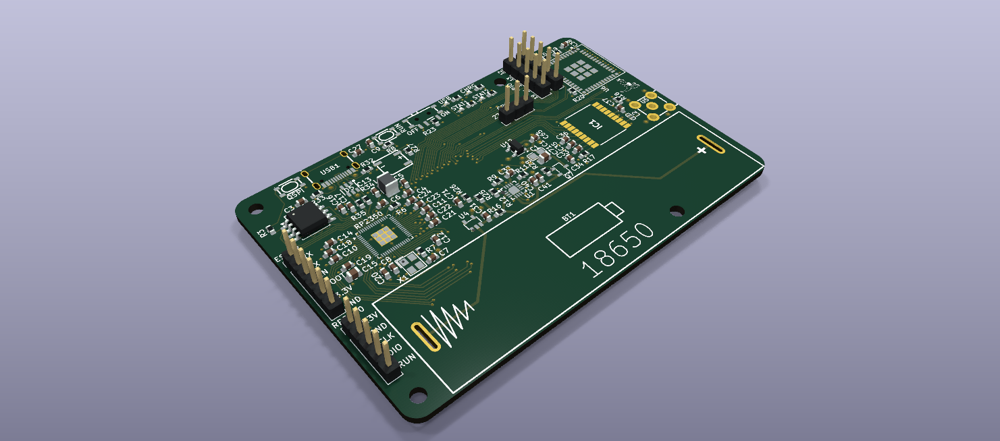
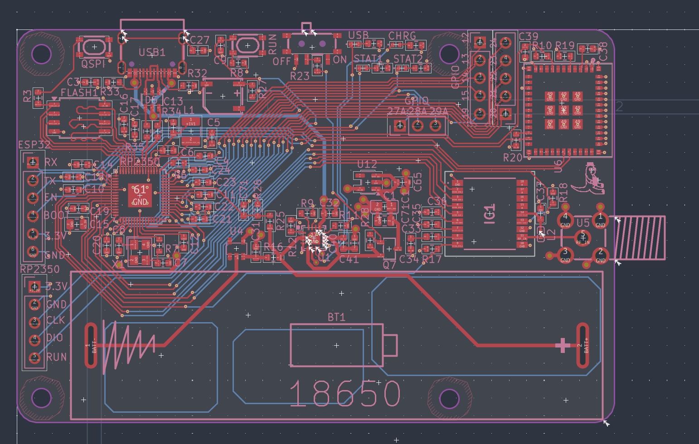
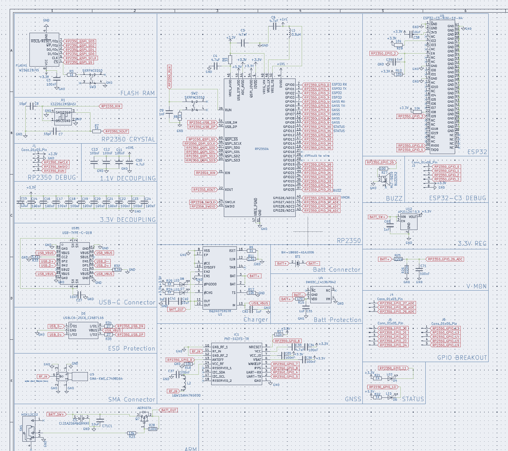

# PiSat
A GPS Microcontroller for RTK GPS applications

## 3D Preview

## Wiring

## Schematic

### Download the ./latestProduction folder to begin fabricating through JLCPCB. 

## Introduction
PiSat is a complete microcontroller with an embbedded GPS chip all in the footprint of a Raspbbery Pi. It uses an RP2350 for parallel computing + an esp32 for wifi connectivity. In addition, it uses the PNT-SG3FS-TR GPS chip with an SMA connector to attach an external GPS antenna. It also can run completely on battery power for an estimated 12 hours (based on the suggested battery) at full load.

The main use case for this is in the Real Time Kinematic (RTK) GPS system, which requires two GPS recievers: one at a known location and one at the location being tracked. By calculating the error that both recievers share with other satilletes, this method can track an object down to just a few centimeters. The main drawback to RTK GPS systems is that they usually require expensive mcu for the calculations + external GPS modules which can increase the cost substantially. A fully embbedded approach makes the price much more approachable to hobbists.

Note: this is licensed under the GPL/GNU license which means editing it is fine, just make sure to keep it open source.

## Bill of Materials 

### (Minimum build for RTK GPS system: 2 PiSats)

| Quantity | Components |  Price | Link |
|--------- |----------|----------| -----|
| 2  | 18650 Batteries | ~$20 (with shipping) | [here](https://liionwholesale.com/products/molicel-npe-inr-18650-m35a-10a-3500mah-flat-top-18650-battery-authorized-distributor?variant=32004772528197)
| 2 | GPS Antenna | $7 (Flexible Antenna) or $10 (Straight Antenna) | [here](https://www.aliexpress.us/item/3256804609969855.html?spm=a2g0o.productlist.main.22.2d61135313537Z&algo_pvid=a8f1f363-3e79-462c-8226-c544dbba9469&algo_exp_id=a8f1f363-3e79-462c-8226-c544dbba9469-21&pdp_ext_f=%7B%22order%22%3A%221213%22%2C%22eval%22%3A%221%22%2C%22fromPage%22%3A%22search%22%7D&pdp_npi=6%40dis%21USD%215.00%213.50%21%21%215.00%213.50%21%402103119c17817420491787632e4325%2112000030518552990%21sea%21US%217493938711%21X%211%210%21n_tag%3A-29913%3Bd%3Ad260408f%3Bm03_new_user%3A-29895&curPageLogUid=FQzx1wWXtUoX&utparam-url=scene%3Asearch%7Cquery_from%3A%7Cx_object_id%3A1005004796284607%7C_p_origin_prod%3A#nav-specification) or [here](https://www.aliexpress.us/item/3256809038076860.html?spm=a2g0o.productlist.main.2.2151p6Ftp6FtTh&algo_pvid=996be7bb-70aa-4be7-8faf-292b35948f71&algo_exp_id=996be7bb-70aa-4be7-8faf-292b35948f71-1&pdp_ext_f=%7B%22order%22%3A%22245%22%2C%22eval%22%3A%221%22%2C%22fromPage%22%3A%22search%22%7D&pdp_npi=6%40dis%21USD%2113.26%215.19%21%21%2189.21%2134.92%21%402101e80317817623348108445eaaa5%2112000048375428405%21sea%21US%217493938711%21X%211%210%21n_tag%3A-29913%3Bd%3Ad260408f%3Bm03_new_user%3A-29895%3BpisId%3A5000000209191311&curPageLogUid=Bw3eYI7vcVpx&utparam-url=scene%3Asearch%7Cquery_from%3A%7Cx_object_id%3A1005009224391612%7C_p_origin_prod%3A#nav-specification)
| 2 | 2.4G Wifi Antenna | $3.55 | [here](https://www.aliexpress.us/item/3256802833801038.html?spm=a2g0o.productlist.main.17.44bbCrBdCrBdFl&algo_pvid=20d56933-2b0c-45d5-8601-1bc6a9682401&algo_exp_id=20d56933-2b0c-45d5-8601-1bc6a9682401-16&pdp_ext_f=%7B%22order%22%3A%221074%22%2C%22eval%22%3A%221%22%2C%22fromPage%22%3A%22search%22%7D&pdp_npi=6%40dis%21USD%213.55%213.52%21%21%213.55%213.52%21%402101ef5e17781321493642302e40a6%2112000023272348781%21sea%21US%217493938711%21X%211%210%21n_tag%3A-29913%3Bd%3A21b1ce8d%3Bm03_new_user%3A-29895&curPageLogUid=rLnZuf4b98Bi&utparam-url=scene%3Asearch%7Cquery_from%3A%7Cx_object_id%3A1005003020115790%7C_p_origin_prod%3A)
| 2  | PiSat PCBs | ~$100 (with shipping, cost can vary widely however) | Download repo, extract fabrication files from ./latestProduction, and fabricate through JLCPCB (complete instructions for this may come soon)

Total cost: **$130.55**

Cost per unit: **$65.28**

----

## Tools:
- Soldering iron + solder

## Assembly:
1. (If using vertical mount case) Screw into 3 of the mounting holes on the board, only screw into the 1 mounting hole below the battery if completely necessary
2. Solder on the battery connector
3. Screw in the wifi antenna onto the esp32
4. Screw in the GPS antenna onto the SMA connector
5. Insert battery into battery connector and turn on